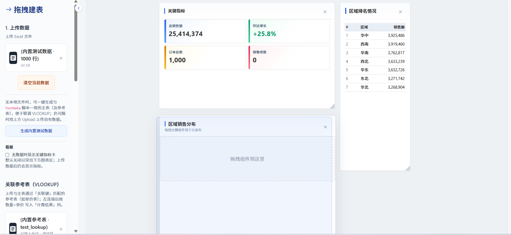
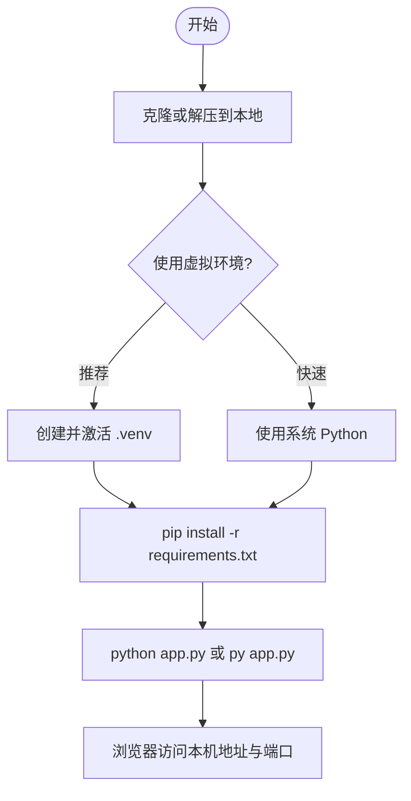
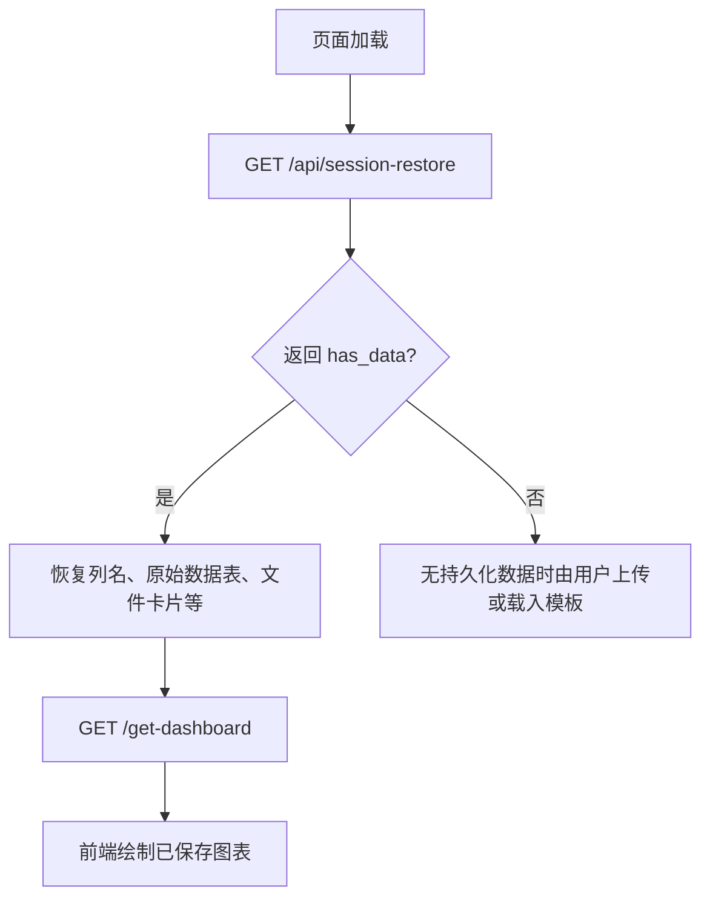
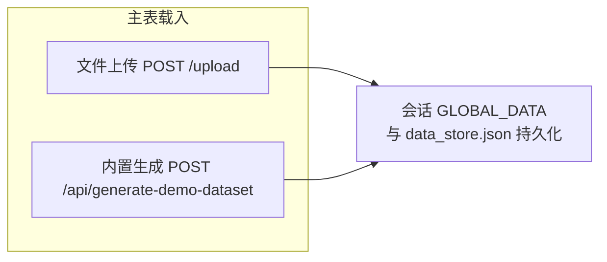

# Smart Data Report（智能数据报表）

基于 **Flask + pandas + Plotly** 的 Web 智能报表看板：上传 Excel/CSV、拖拽图表、会话持久化、多格式导出与简易数据质检。个人学习 / 作品集项目，侧重完整数据链路而非商业级多租户能力。



## 快速开始

```powershell
python -m venv .venv
.\.venv\Scripts\Activate.ps1
pip install -r requirements.txt
python app.py
```

浏览器访问 **http://127.0.0.1:5000/**。侧栏可生成内置演示数据，无需自备 Excel。

**安全提示**：勿将 `.env`、`data/data_store.json` 或用户上传文件提交到仓库（见 `.gitignore`）。公网部署前请设置 **`FLASK_SECRET_KEY`**（见 [生产环境部署要点](#5-生产环境部署要点)）。

---

下文为安装、部署与使用说明。功能上接近常见「接表 → 出图 → 摆看板」的报表 / BI 工具流程，实现为单进程、轻量版本。

**路径约定**：**`<Project_Root>`** 指与 `app.py`、`requirements.txt` 同级的仓库根目录。`uploads/`、`data/`、`static/` 等路径均相对该目录。安装与启动命令请在 `<Project_Root>` 下执行。

---

## 目录

1. [项目简介](#1-项目简介)
2. [运行环境](#2-运行环境)（含 [2.1 前端与静态资源](#21-前端与静态资源)）
3. [安装步骤](#3-安装步骤)（含 [3.4 快速上手流程图](#34-快速上手流程图)）
4. [启动与访问](#4-启动与访问)
5. [生产环境部署要点](#5-生产环境部署要点)
6. [目录与运行时数据](#6-目录与运行时数据)
7. [使用说明](#7-使用说明)（含 [7.5 内置测试数据](#75-内置测试数据)）
8. [主要 HTTP 接口一览](#8-主要-http-接口一览)
9. [常见问题 FAQ](#9-常见问题-faq)

---

## 1. 项目简介

**Smart Data Report** 是一款 **Web 智能报表 / BI 看板** 应用：支持上传 Excel/CSV、侧栏一键生成内置演示数据、拖拽生成图表、看板 Dock 布局、日期与维度筛选、参考表关联、智能多级表、模板载入、数据导出与异常检测等；目标是在浏览器里较快组合出常用分析视图。

**技术栈（与 `requirements.txt` 一致）**

| 组件 | 说明 |
|------|------|
| Flask 3.x | Web 框架 |
| flask-cors | 跨域支持 |
| pandas / numpy | 数据处理 |
| openpyxl | Excel 读写 |
| plotly | 图表渲染（JSON 下发前端） |
| Pillow | PNG 简易报表（`/download-report`）等 |
| reportlab / matplotlib | PDF 等导出相关 |

---

## 2. 运行环境

- **Python**：建议 **3.10 及以上**（`pandas 3.x` 需要 Python 3.10+，见 `requirements.txt` 首行说明）。
- **操作系统**：Windows、Linux、macOS 均可；下文命令在 Windows 下可使用 `py` 启动器，Linux/macOS 通常使用 `python3` / `python`。

### 2.1 前端与静态资源

- **无需 Node.js / npm / 前端构建**：业务脚本与样式由 Flask 直接以静态文件提供，例如 [`templates/index.html`](templates/index.html) 中引用的 `/static/css/style.css`、`/static/js/drag.js`。克隆代码、安装 Python 依赖后即可使用，**不必**执行 `npm install` 或 Webpack/Vite 等打包命令。
- **浏览器需能访问公网 CDN**：同一模板中通过 jsDelivr、cdnjs、Plotly 官方 CDN 等加载 Bootstrap、Sortable、Plotly.js、html2canvas 等。**纯内网或离线环境**下页面可能空白或图表无法渲染，需自行改为内网镜像源或将对应 JS/CSS 下载到 `static/` 并修改模板中的 `<script>` / `<link>` 路径。
- **Plotly 分工**：后端 Python 包 `plotly` 负责生成图表 JSON；前端由 CDN 上的 Plotly.js 负责渲染，与是否安装 Node 无关。

---

## 3. 安装步骤

### 3.1 获取代码

将仓库克隆或解压到本机**任意可写路径**，该路径即 **`<Project_Root>`**。

以下安装命令均在 **`<Project_Root>`** 下执行（当前工作目录需包含 `app.py` 与 `requirements.txt`）；**均需联网**下载 PyPI 包。

---

### 3.2 推荐方式：使用虚拟环境（venv）

依赖与项目隔离，避免污染系统或其它项目，**推荐**日常开发与部署采用本方式。

**Windows（PowerShell）**

```powershell
python -m venv .venv
.\.venv\Scripts\Activate.ps1
pip install -r requirements.txt
```

**Linux / macOS**

```bash
python3 -m venv .venv
source .venv/bin/activate
pip install -r requirements.txt
```

之后每次使用前在对应终端 **先激活** 上述虚拟环境，再执行 [第 4 节](#4-启动与访问) 的启动命令。

---

### 3.3 快速方式：直接安装到当前 Python（全局）

未使用虚拟环境时，可直接把依赖装进当前默认的 Python 解释器（**全局 site-packages**）：

```bash
pip install -r requirements.txt
```

Windows 若 `pip` 未加入 PATH，可改用：

```bash
py -m pip install -r requirements.txt
```

**注意**：全局安装会与机器上其它 Python 项目共用同一套包版本，若出现依赖冲突，请改回 [3.2 推荐方式](#32-推荐方式使用虚拟环境venv)。

`requirements.txt` 中已包含 **Pillow**（用于 `GET /download-report` 等），与上述任一方式一并安装即可，无需再单独执行 `pip install Pillow`。

### 3.4 快速上手流程图

下列 **Mermaid** 图在 GitHub、VS Code 等 Markdown 预览中可渲染：前两张概括「安装—启动—恢复会话」；第三张与 **§7.1、§7.5** 对应，说明主表进入会话的两种路径。

**从安装到本地访问**



**刷新页面后的会话恢复（与 §7.2 对应）**



**主表数据的两种载入（与 §7.1、§7.5 对应）**



**关于截图**：本说明默认仅用上述流程图，便于维护、不增加仓库体积。若需要「逐步点哪里」的界面级教程，可自行在 **`<Project_Root>/docs/images/`** 放置截图并在本文用相对路径引用；UI 改版后需同步更新图片。

---

## 4. 启动与访问

### 4.1 开发模式（默认）

在 **`<Project_Root>`** 下执行：

```bash
python app.py
```

或（Windows 常见）：

```bash
py app.py
```

默认 Flask 开发服务器监听 **`http://127.0.0.1:5000/`**（端口与 `app.run(debug=True)` 的 Flask 默认值一致；若需改端口，可在 `app.py` 末尾改为 `app.run(debug=True, port=5001)` 等）。

- **改端口前请先确认端口未被占用**，否则启动会失败或表现为端口被抢占：  
  - Windows（CMD/PowerShell）：`netstat -ano | findstr :5001`（将 `5001` 换成你的端口），在任务管理器或 `taskkill` 中结束占用进程，或换一个未监听端口。  
  - Linux / macOS：如 `ss -tlnp | grep 5001` 或 `lsof -i :5001`。

浏览器访问：**http://127.0.0.1:5000/**（若改了端口，请改为 `http://127.0.0.1:端口号/`）

### 4.2 关于 `debug=True`

当前入口为 **开发模式**（`debug=True`），适合本地调试；**生产环境请务必关闭 debug**，并使用下文 WSGI 方式托管，避免暴露调试信息与性能问题。

---

## 5. 生产环境部署要点

### 5.1 使用 WSGI 服务器

勿在生产中长期使用 Flask 内置单线程服务器。可选用 **Waitress**（跨平台）或 **Gunicorn**（Linux 常见）等托管 `app` 对象。

**示例：Waitress**（需 `pip install waitress`）

```bash
waitress-serve --listen=0.0.0.0:8000 app:app
```

其中 `app:app` 表示「`app.py` 模块中的变量 `app`（Flask 实例）」；请在 **`<Project_Root>`** 下执行上述命令，保证能导入 `app`。

**示例：Gunicorn**（常见于 Linux，需 `pip install gunicorn`）

```bash
gunicorn -b 0.0.0.0:8000 app:app
```

### 5.2 安全

- **务必设置环境变量** `FLASK_SECRET_KEY`（足够长的随机字符串）再部署或公网暴露；未设置时仓库内仅为本地开发占位，**切勿**直接用于生产。

  设置示例（**PowerShell**，仅当前终端会话有效）：

  ```powershell
  $env:FLASK_SECRET_KEY = "请替换为长随机字符串"
  ```

  **Linux / macOS（bash）**：

  ```bash
  export FLASK_SECRET_KEY="请替换为长随机字符串"
  ```

- 建议前置 **Nginx**（或同类反向代理）处理 HTTPS、静态资源缓存与限流。

### 5.3 CORS

项目已启用 `flask-cors`（`CORS(app)`）。若前端与后端不同域，请按实际前端地址配置 CORS 策略（必要时在代码中收紧 `origins`，而非全局放开）。

---

## 6. 目录与运行时数据

| 路径 / 文件 | 说明 |
|-------------|------|
| `uploads/` | 上传临时目录；应用启动时若不存在会自动创建。 |
| `data/data_store.json` | **会话持久化文件**（默认不纳入 Git，见根目录 `.gitignore`；克隆后由程序在运行时生成）：主表行数据、列映射、参考表数据、三列映射（日期/数值/维度）、**仪表盘图表列表**等。应用 **import `app` 模块末尾** 会调用 `load_global_data_store()` 自动加载；数据变更后在代码路径中会调用 `save_global_data_store()` 写回。 |
| `report_templates/` | 报表模板 JSON，供智能表与模板载入等接口使用。 |
| `fonts/` | **可选**：导出 PDF 时中文字体（如 `SimHei.ttf`、`msyh.ttc`）可放在 **`<Project_Root>/fonts/`**，详见 `utils/session_export.py` 内说明。 |
| `utils/pressure_mock.py` | **内置测试数据生成**：构造与「上传 Excel」列名一致的主表（日期、区域、产品类型、销售额、成本、销量）及参考表（产品类型、负责人、售后政策、标准单价），供 `POST /api/generate-demo-dataset` 与根目录脚本共用。 |
| `generate_mock_data.py` | **命令行写盘**：在 `<Project_Root>` 下执行 `python generate_mock_data.py`，于 **`TestData/`** 生成 `test_main_1000.xlsx`、`test_lookup.xlsx`（需已安装依赖）；与网页按钮写入会话的路径**相互独立**，可按需选用。 |
| `TestData/` | 上述脚本输出目录（若不存在会创建）；**应用运行不依赖此目录**，亦可手动将其中文件通过侧栏 Upload 上传以载入相同数据。 |

**说明**：清除全部会话会清空 `GLOBAL_DATA` 并写回空的 **`data/data_store.json`**（或等价空状态）；若文件损坏，加载逻辑可能删除损坏的 **`data/data_store.json`** 并打印日志，需重新上传数据。

**Windows 写入权限提示**：应用会在 **`<Project_Root>`** 下自动创建 **`uploads/`**、**`data/`** 并写入 `data/data_store.json`。若将仓库放在系统保护的只读目录、或当前用户对该路径无写权限，可能导致目录创建或持久化失败。请将 **`<Project_Root>`** 设为用户主目录下的自建文件夹等可写位置；若遇杀毒或企业策略拦截，请为该项目目录放行写权限。

---

## 7. 使用说明

### 7.1 基本流程

1. 浏览器打开首页 `/`。
2. **载入主表（二选一）**  
   - **上传文件**：上传 **`.xlsx` / `.xls` / `.csv`**（`POST /upload`）。  
   - **无文件快速体验**：侧栏 **「生成内置测试数据」** 按钮，调用 **`POST /api/generate-demo-dataset`**，写入与 `generate_mock_data.py` / `TestData` 一致的主表（默认 1000 行）及参考表，便于联调 VLOOKUP；之后仍可随时上传自有文件覆盖会话。
3. 在侧栏选择图表或智能表格等组件，**拖拽到画布**；按页面提示配置坐标轴或模板。
4. 使用 **日期筛选、列映射、KPI 看板、参考表上传与关联** 等能力（见接口表）。
5. 使用 **导出中心** 导出 Excel / PDF / CSV（`GET /api/export` 等）。

### 7.2 刷新与重启后的数据恢复

- 服务端在启动时会从 **`data/data_store.json`** 恢复 `GLOBAL_DATA` 与仪表盘图表列表。
- 前端在页面加载时会请求 **`GET /api/session-restore`**，在存在已恢复数据时自动填充列名、原始数据表 HTML、文件卡片等，并再请求 **`GET /get-dashboard`** 重绘图表。  
因此 **整页刷新或重启后端后**，只要 **`data/data_store.json`** 完整，一般 **无需重新上传** 即可继续分析（已保存的图表也会恢复）。

### 7.3 清除数据

- 移除当前上传并清空会话：使用页面「清除」类按钮或调用 **`POST /clear-upload`**、**`POST /api/clear-session`**（与后端实现一致）。
- **仅清空画布图表、保留主表**：**`POST /reset-dashboard`**。

### 7.4 异常检测

对已载入主表执行离群与数据质量检测：**`POST /api/detect-anomalies`**（请求体可为空 JSON `{}`）；返回 `report` 字段含摘要与明细项。主界面顶栏 **「数据质量检测」** 按钮会打开模态框并调用同一接口展示结果。

### 7.5 内置测试数据

除 **§7.1** 中的文件上传外，系统提供**不依赖本地 Excel 文件**的演示主表载入方式，便于课堂演示、联调 VLOOKUP 与压力场景复现。

**侧栏入口。** 在 **「1. 上传数据」** 区块内，「清空当前数据」下方有 **「生成内置测试数据」** 按钮。点击后浏览器向 **`POST /api/generate-demo-dataset`** 发送 JSON（当前前端默认 `{"n_rows":1000,"seed":42,"include_lookup":true}`）。若当前已有主表数据，会先弹出浏览器确认框，避免误覆盖。

**服务端行为（与 `POST /upload` 对齐的关键点）。**

- 使用 **`utils/pressure_mock.py`** 在内存中生成 `pandas.DataFrame`，经与上传相同的日期列、数值列规整后写入 **`GLOBAL_DATA["data"]`**；**`data_source`** 记为 **`demo_generated`**；**`filename` / `filesize`** 为便于识别的占位描述。
- **清空服务端看板图表列表**（与换新主表一致），避免旧图表列与新主表不一致。
- 当 **`include_lookup`** 为 `true`（默认）时，同时写入 **`lookup_data` / `lookup_filename`**，列结构与 `TestData/test_lookup.xlsx` 一致；为 `false` 时移除会话中的参考表。
- 调用 **`save_global_data_store()`** 持久化到 **`data/data_store.json`**。
- 请求体 **`n_rows`** 会被限制在 **10～10000**；**`seed`** 取整后参与可复现随机序列。

**响应与前端。** 成功响应字段与上传成功类接口相近（含 **`raw_data_html`**、**`column_mapping_suggestion`**、**`mapped_columns`** 等）；若含参考表，另返回 **`lookup_all_columns`** 等以便侧栏 VLOOKUP 区同步。随后仍会弹出 **列映射** 模态框，用户可直接确认或修改后再分析。生成完成后仍可通过 **Upload** 上传自有文件，**完全覆盖**当前会话主表与默认参考表。

**命令行对照。** 若需在版本库或 CI 中产出固定 Excel 文件而非写会话，请在 `<Project_Root>` 执行 **`python generate_mock_data.py`**，输出见 **§6** 中 **`TestData/`** 说明。

**部署提示。** 若将应用暴露于公网，该接口可能被滥用以刷写内存与磁盘；生产环境宜加鉴权、限流或仅在内网/演示环境启用。

---

## 8. 主要 HTTP 接口一览

以下为 `app.py` 中注册的路由，便于联调与二次开发（方法未注明则为 GET）。

| 路由 | 方法 | 说明 |
|------|------|------|
| `/` | GET | 首页 |
| `/upload` | POST | 上传主表文件 |
| `/api/generate-demo-dataset` | POST | 内存生成主表+可选参考表写入会话（见 [§7.5](#75-内置测试数据)）；JSON 可选 `n_rows`（10～10000）、`seed`、`include_lookup` |
| `/upload-lookup` | POST | 上传参考表 |
| `/apply-lookup` | POST | 主表与参考表关联计算 |
| `/clear-lookup` | POST | 清除参考表 |
| `/create-chart` | POST | 生成图表 JSON（不写入看板列表） |
| `/add-chart` | POST | 添加图表到服务端看板并持久化 |
| `/get-dashboard` | GET | 获取当前看板图表列表 |
| `/api/session-restore` | GET | 前端首屏恢复：列、HTML、映射等 |
| `/api/dashboard-metrics` | POST | KPI 与排行等指标 |
| `/api/column-mapping-state` | GET | 列映射状态 |
| `/api/detect-anomalies` | POST | 异常检测 |
| `/reset-dashboard` | POST | 清空看板图表（保留主表） |
| `/clear-upload` | POST | 清除上传与会话 |
| `/api/clear-session` | POST | 同上（显式清理） |
| `/update-layout` | POST | 更新图表布局位置 |
| `/toggle-theme` | POST | 切换主题 |
| `/download-report` | GET | 下载简易 PNG 报表（依赖 Pillow，已列入 `requirements.txt`） |
| `/api/export` | GET | 导出主表（`format=excel|pdf|csv`） |
| `/save-layout` | POST | 保存布局到 Session |
| `/get-layout` | GET | 读取布局 |
| `/balance-sheet` | GET | 资产负债表页面 |
| `/api/templates` | GET | 模板列表 |
| `/api/mock-rates` | GET | Mock 汇率 |
| `/api/insights` | POST | 洞察 |
| `/api/get-details` | POST | 明细 |
| `/api/chart-render` | POST | 图表渲染 |
| `/api/template-column-tree` | GET | 模板列树 |
| `/smart-table` | POST | 智能表格 HTML |
| `/api/session-manual` | POST | 手动/模拟数据写入会话 |
| `/api/load-template-data` | POST | 载入模板示例数据 |

---

## 9. 常见问题 FAQ

**Q：端口 5000 已被占用？**  
A：修改 `app.py` 中 `app.run(..., port=其他端口)`，或生产环境用 WSGI 的 `--listen` 指定端口。

**Q：`pip install` 失败或很慢？**  
A：检查 Python 版本是否 ≥3.10；可换国内 PyPI 镜像或公司内网源。

**Q：PDF 导出中文是方框？**  
A：将黑体/微软雅黑等字体文件放入 **`<Project_Root>/fonts/`**（若不存在可自建该文件夹），详见 `utils/session_export.py` 顶部注释。

**Q：刷新后页面又像没上传？**  
A：确认 `data/data_store.json` 存在且非 0 字节；浏览器控制台是否对 `/api/session-restore` 报错；后端日志是否有「加载 data_store.json 失败」并删除了损坏文件。

**Q：`/download-report` 报错找不到 PIL？**  
A：请确认已执行 `pip install -r requirements.txt`（其中已含 Pillow）；若仍失败，可单独执行 `pip install Pillow` 排查环境是否指向了错误的 Python。

**Q：生产环境还要注意什么？**  
A：关闭 Flask `debug`、设置环境变量 **`FLASK_SECRET_KEY`**（勿把真实密钥写入仓库）、使用 HTTPS 与进程守护（systemd、NSSM 等），并定期备份 `data/data_store.json`。

---

## 版本与依赖声明

- 依赖包及版本以 **`<Project_Root>/requirements.txt`** 为准；若与本文示例命令不一致，以文件为准。
- 本文随项目迭代可能需手工更新；重大行为变更请以 `app.py` 与前端 `static/js/drag.js` 为准。
- **图示策略**：上文 [§3.4](#34-快速上手流程图) 使用三张 Mermaid 图（安装启动、会话恢复、主表双路径载入）降低纯文字密度；界面截图非必需，按需自行补充即可。
